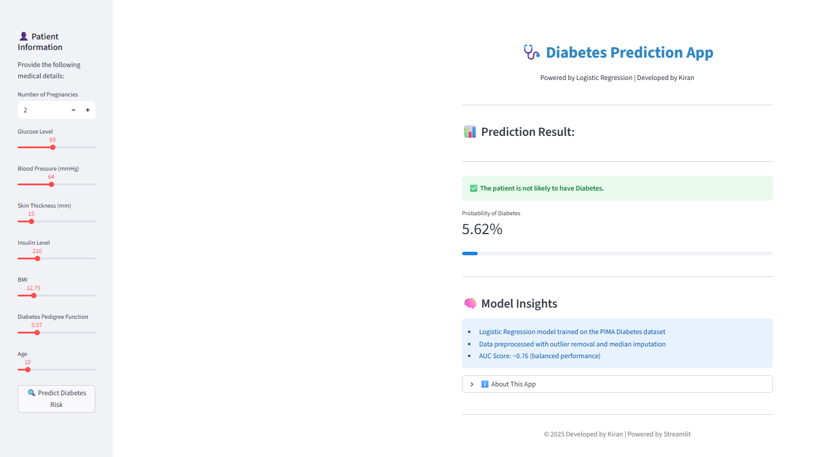

# Diabetes Risk Predictor

A machine learning web application for predicting diabetes risk using Logistic Regression and Streamlit.
The project demonstrates an end-to-end workflow including model training, deployment, and interactive clinical input handling.

---

## 🔗 Live Demo
[https://Y.streamlit.app](https://diabetes-risk-predictor-aay76hz4jqgepztkcsn2qb.streamlit.app/)

## Overview

This repository contains a Streamlit-based interface that estimates diabetes risk from clinical parameters.
The application loads a trained Logistic Regression model and generates probability-based predictions in real time.

The objective of this project is to showcase practical machine learning deployment within a healthcare analytics context.

---

## Features

* Interactive web interface built with Streamlit
* Probability-based diabetes risk prediction
* Logistic Regression model implementation
* Lightweight and reproducible setup

---

## Model Details

* Algorithm: Logistic Regression
* Dataset: PIMA Indian Diabetes dataset
* Performance: Approx. AUC ≈ 0.76
* Preprocessing:

  * Median imputation
  * Outlier handling
  * Feature scaling

---

## Input Variables

* Pregnancies
* Glucose Level
* Blood Pressure
* Skin Thickness
* Insulin Level
* BMI
* Diabetes Pedigree Function
* Age

---

## 📁 Folder Structure

```id="n6z7xa"
diabetes-risk-predictor/
│
├── app.py                         # Streamlit application (main entry point)
├── Diabetes_prediction_model.pkl # Trained Logistic Regression model
├── requirements.txt              # Python dependencies
├── README.md                     # Project documentation
├── .gitignore                    # Files excluded from version control
│
├── assets/
│     └── app_preview.png         # Application screenshot
│
└── notebooks/
      └── Diabetes_Prediction_Model.ipynb  # Model training and experimentation
```


---

## Installation

Clone the repository:

```
git clone https://github.com/kirankumar88/diabetes-risk-predictor.git
cd diabetes-risk-predictor
```

Install dependencies:

```
pip install -r requirements.txt
```

Run the application:

```
python -m streamlit run app.py
```

---
## Application Preview

## Disclaimer

This application is intended for educational and research purposes only.
It does not provide medical advice or clinical diagnosis.

---

## Author

Kiran Kumar

